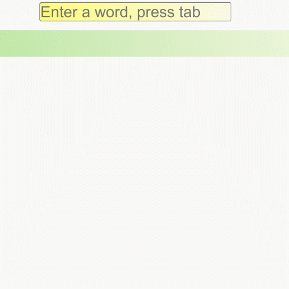

# Point-a-character
https://paloranta.github.io/point-a-character-demo/index.html

A game for teaching a child to read and move the mouse cursor around.

The idea is to write a word, and the child needs to point the mouse cursor at each character while avoiding touching an obstacle.
Each character is read aloud with the speech API.



Utilizes experimental features of Chrome-based browsers, ```experimental web platform features``` must be enabled in ```chrome://flags```.

TODO:
- Responsify the playing area, now the canvas is fixed size.
- Make a check for obstacles and characters over each other, now it's possible to have a character under an obstacle.
- Some other stuff.
